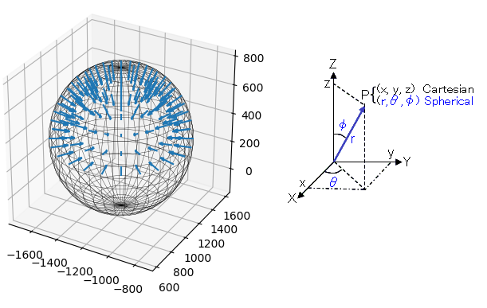

# AirSimCollect

This module provides a CLI to allow individuals to collect data from AirSim.

Currently it uses the computer vision mode to navigate an AirSim environment and collect data. Future work will provide actual vehicle control if needed.

This module provides two scripts: `poi` (**P**oints **O**f **I**nterst) and `asc` (**A**ir**S**im**C**ollect). The former generates collection points (position and angles of camera/multirotor stored as numpy array) that capture points of interest specified in a GeoJSON map file of an unreal environment. The latter uses these collection points to collect simulation data (e.g. scene images, segmentation images, Lidar) and save them.  There are many discoverable options that can be configured. 

## Documentation

This module provides a cli that allows you to specify arguments about the desired data to collect. The scripts `poi` and `asc` are entirely separate from each other but powerful when used together. `poi` is only interested in generating collection points (camera/vehicle position, rotation) to capture points of interest, `asc` is only interested in collecting simulation data.

## Points Of Interest, `poi`

What follows is terminology and graphs to explain how `poi` generates collection points from points of interest.

Terminology:
 * `Collection point` - A point in an environment from which a sensor payload (vehicle, cameras etc.) is placed in order to collect data. It consists of an x,y,z point with rotation angles (phi (pitch), roll, theta (yaw)). The rotation angles are based on a spherical coordinate system which are explained below.
 * `Focus point` - A point in a an environment that is the focus of a collection activity. This the center of a collection sphere. The sensor payload is *pointed* to the `focus point`.
 * `Collection Sphere` - Data is collected by generating a sphere whose center is a `Focus point`. Collection points are points on the *surface* of the sphere. You specify *where* on the sphere a `collection point` is by manipulating the *range* and angle *step size* phi and yaw. See picture below
 * `Point of interest (poi)` - This is *something* in an environment that you are interested in sampling. The `poi` script expects this to be represented in a [GeoJSON file](https://github.com/frewsxcv/python-geojson) with a `feature collection`. Each `feature` represents a `poi`, this can be an actual point (x,y) or a polygon (collection of points). There should be a property associated with it that holds a `height` key set to the height of the point.  Please look at the example file under asset/sample/point_cloud_map_levelediting.json. The actual geometry is actually 2D, the third dimension is specified with the property `height`.

 
The image below shows a collection sphere on the left. The center of the sphere ,~ (1300, -1300, 350), is the focus point. The arrows facing in represent *where* sensor payload will be and *how* it will be facing (vector direction). The vector direction is determined by the phi and theta angles. The right picture shows and example coordinate system.

 

 Points are saved as a numpy array with 6 dimensions (x, y, z, phi, 0, theta). There are many arguments you can specify to manipulate the following:

* If `poi` (feature) is a polygon, what point on the polygon should be the focus point?
* What is the radius of the collection sphere? You can set it with `--radius-min`.
* Can I have multiple collection spheres for the same focus point, but just farther away?  Yes, change `--num-spheres` and `--radius-delta`.
* Can I see a picture of the points being generated? Yes use `--plot-points` for debugging.

### CLI Arguments

```
$ poi generate --help
Usage: poi generate [OPTIONS]

Options:
  -m, --map-path PATH             GeoJSON map file of points of interests
                                  (features) in the UE4 world.  [required]
  -pr, --pitch-range FLOAT...     Range in pitch (phi) on a collection sphere
                                  to sample each collection point  [default:
                                  30, 90]
  -pd, --pitch-delta FLOAT        Change in pitch angle (degrees) on
                                  collection sphere for each collection point
                                  [default: 15.0]
  -yr, --yaw-range FLOAT...       Range in yaw (theta) on a collection sphere
                                  to sample each collection point  [default:
                                  0, 360]
  -yd, --yaw-delta FLOAT          Change in yaw angle (degrees) on collection
                                  sphere for each collection point  [default:
                                  15.0]
  -ns, --num-spheres INTEGER      Number of collection spheres to generate and
                                  sample from.  [default: 1]
  -rm, --radius-min FLOAT         Minimum radius of collection sphere
                                  (distance from the focus point). If 0 and
                                  map feature is a polygon, will use smallest
                                  sized circle to circumscribe polygon. If 0
                                  and map feature is a point, set to 500.
                                  [default: 0.0]
  -rd, --radius-delta FLOAT       Change in growing collection sphere radius.
                                  Only applicable for -ns > 1.  [default:
                                  500.0]
  -fp, --focus-point [pia|centroid|random]
                                  Only applicable to polygon features.
                                  Determines what point on a 2D polygon should
                                  be used as the center of the collection
                                  sphere  [default: centroid]
  -nf, --num-focus-points INTEGER
                                  Number of focus points to randomly generate
                                  on 2D polygon. Only applicable to -fp
                                  random.  [default: 1]
  -o, --out PATH                  Output numpy array of position and angles
                                  [default: collection_points.npy]
  -ao, --append-out               If output file already exists, just append
                                  to to it  [default: False]
  --seed INTEGER                  Random seed  [default: 1]
  -ic, --ignore-collision         By default this module ensures the
                                  collection point does not collide with any
                                  known features in the map. Set this flag to
                                  ignore this check.  [default: False]
  -pp, --plot-points              Whether to plot points for viewing. Debug
                                  only.  [default: False]
  --help                          Show this message and exit.
```

## Air Sim Collector, `asc`

This script takes in a configuration file and then begins to collect data from AirSim. Below is some terminology

* `Collector` - Some type of sensor to collect data. Currently only supports images.
* `Collection points` - Same as defined in `poi`. Points specifying where to teleport the AirSim vehicle and how to face it for data collection. Must be a numpy array with shape (num_points, 6).

Default configuration file:
```json
{
    "name": "AirSimCollect",
    "sim_mode": "ComputerVision", // what mode are we in, doesn't doing anything now.
    "save_dir": "AirSimCollectData", // where to save the data
    "ignore_collision": False ,
    "segmentation_codes": [], // Very specific to your needs, see examples
    "collectors": [
        DEFAULT_SCENE,
        DEFAULT_SEGMENTATION
    ],
    "collection_points": "", // Numpy array path, NX6, x,y,z,roll,0,theta
    "global_id_start": 0, // start at 0, or even 100 if you want
    "collector_file_prefix": "", // Prefix each file with this string
    "min_elapsed_time": 0.5, // minimum time needed to transfer between each collection point
    "start_offset_unreal": [0, 0, 0] // AirSim origin is at player start. Put player start position here.
}
```
Default values for Scene and Segmentation collectors
```json
DEFAULT_SEGMENTATION = {
    "sensor": "Image",
    "type": "Segmentation",
    "camera_name": "0",
    "image_type":  ImageType.Segmentation,
    "pixels_as_float": False,
    "compress": True
}

DEFAULT_SCENE = {
    "sensor": "Image",
    "type": "Scene",
    "camera_name": "0",
    "image_type": ImageType.Scene,
    "pixels_as_float": False,
    "compress": True
}
```

Most of these settings are self explanatory. The ones that may not are as follows:

* collector_file_prefix - Prefix to file name of any data saved
* ignore_collision - If a collection point collides with something dont sample data. This only works in multirotor mode, which is set in AirSim settings.json
* segmentation_codes - Each code is an array like this: [REGEX<STRING>, OBJECT_ID<INTEGER>]. So this is an array of arrays. This will call AirSim API `simSetSegmentationObjectID` for each regex/code pair.
* collection_points - path to numpy array of collection points
* global_id_start - Each collection point is given an global id. Start count on this.

The basic algorithm is as so:

* Initialize collectors (E.g. run segmentation codes)
* Loop through each collection point
* Move AirSim vehicle to position and angle.
* Collect data, save data
* Got to next point


## File Format

**Ordered**

Prefix-GlobalOrderedID_SensorID.png

**Time**

Prefix-Milliseconds.png

## TODO

* `pip install click-config-file`
* Small default image size (256,144) - Image Request (2) takes about 30 ms, IO Save takes about 10 ms 2 images. Total Time 40-50 ms
* Medium image size (512,512) - Total time about 110 ms


